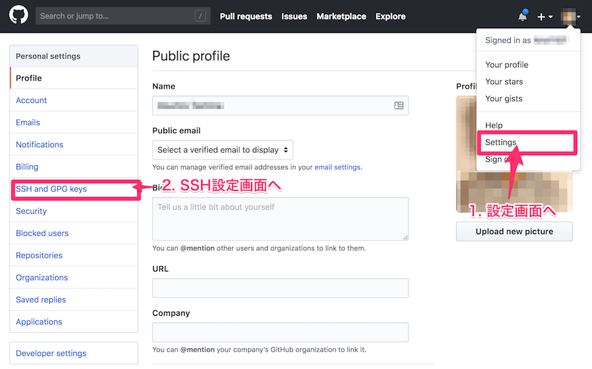
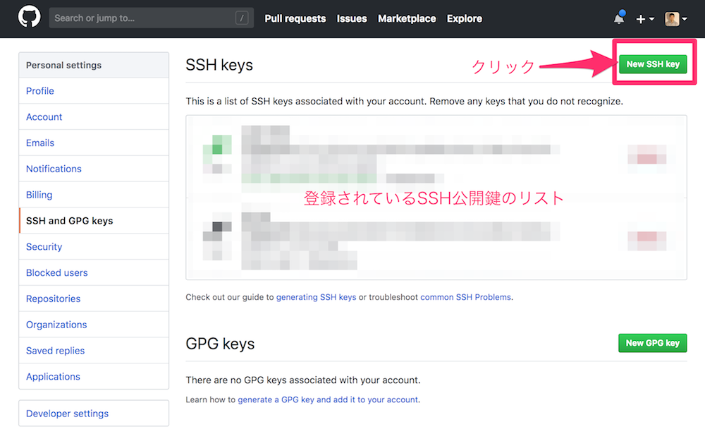
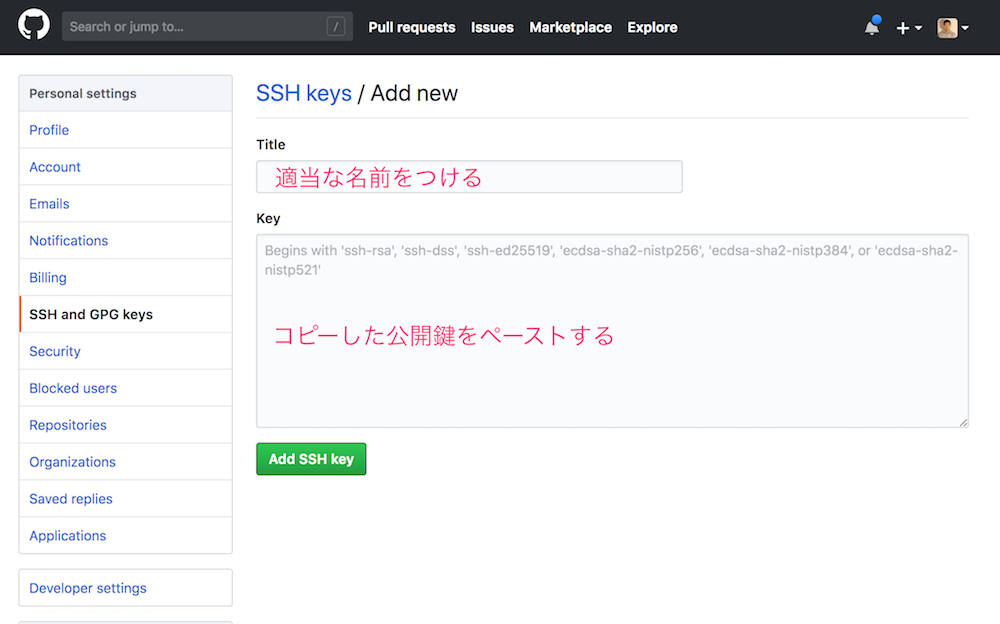

## GitHubへのユーザー登録


まずはGitHubトップページより、ユーザー登録を行いましょう。

## SSHキーペアを作成する

さてGitHubにユーザー登録を行い、これからGitHubにリモートリポジトリを作成しローカルリポジトリのコードをアップロードしていきます。

しかし、その前にしておくべきことがあります。それがSSH認証の設定です。SSHの詳細な仕組みはここでは触れませんが、クラウド上のサーバーと安全にやり取りするための仕組みだと考えてください。

初心者の方にとってちょっとハードルが高いのですが、ローカル上でSSHキーペアを発行し、GitHubに公開鍵を登録して、GitHubとのやり取りの準備を整えます。

人によっては既にSSHキーペアがある場合があります。試しにコマンドラインに以下のコマンドを入力してみてください。

```bash
$ cat ~/.ssh/id_rsa.pub
```

そこで文字の羅列が出てきたらそれがSSHキーペアです。文字の羅列をコピーして次の項目に進んでください。

もし何も出てこなかった場合は以下の手順でSSHキーペアを作成します。

```bash
$ ssh-keygen -t rsa -C "あなたのメールアドレス" -b 4096
Generating public/private rsa key pair.
Enter file in which to save the key (/Users/user_name/.ssh/id_rsa): 
```
ここは現在SSHキーペアがない状態なので、そのまま`Enter`キーを押せば大丈夫です。次にパスフレーズを聞かれます。

```bash
Enter passphrase (empty for no passphrase): 
```

ここには任意のパスワードを入れましょう。確認用にもう一度同じパスワードを求められるので再度入力します。完了すると、以下のようにメッセージが表示されるはずです。

```bash
The key's randomart image is:
+---[RSA 4096]----+
|                 |
|     色々な記号    |
|                 |
+----[SHA256]-----+
```

無事保存が終わったら、作成されたキーペアの公開鍵を確認してコピーします。

```bash
$ cat ~/.ssh/id_rsa.pub
```

## GitHubに公開鍵を登録する

先ほどの項目でコピーした公開鍵をGitHub上で登録します。


まずは、GitHubの画面右上のメニューから"Settings"に進み、その後左のメニューから"SSH and GPG keys"を選びます。



次の画面では、右上に"New SSH key"と書かれたボタンがあるのでこちらをクリックしてください。あるいは直接以下のURLから登録ページに移動できます。

[GitHub SSH設定ページ](https://github.com/settings/ssh/new)


移動したら、分かりやすい名前をつけて、コピーした公開鍵を貼り付けて保存します。

これで準備完了です。