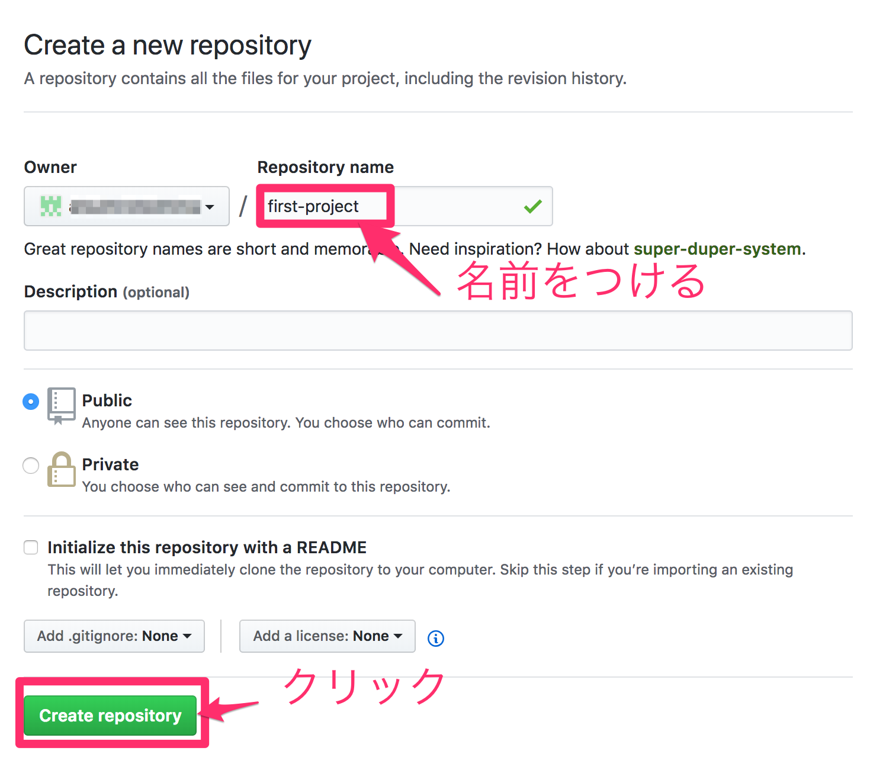
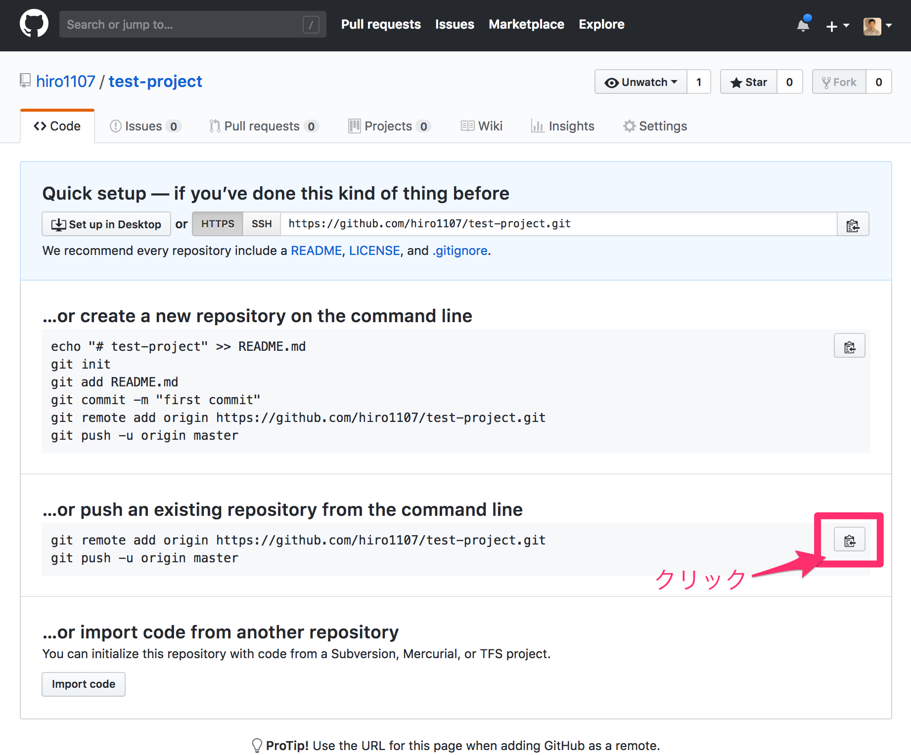
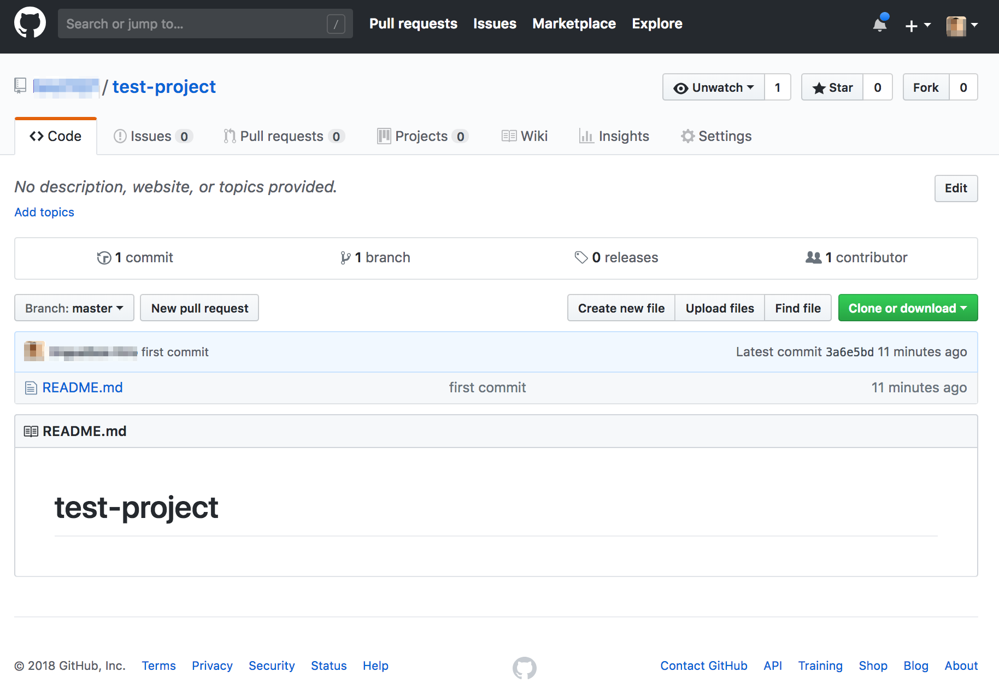

## GitHubにリモートリポジトリを作成する。

次にGitHubにリポジトリを作成しましょう。Lesson1で学んだ通り、このリポジトリのことをパソコン上にあるローカルリポジトリと対比させてリモートリポジトリと呼びます。

作成するには、まずトップページの左上のRepositoriesというメニューから、"New"を選ぶ、あるいは右上の"+"ボタンのメニューから"New Repository"を選びます。


すると、以下のようなページに移動します。



こちらで、適当な名前をつけて、下にある"Create repository"というボタンをクリックすれば完了です。

## GitHub上のリポジトリのURLをローカル上に保存する

リポジトリを作成すると、次のようなページに移動します。



まずは、ローカル上に自分のつけたリポジトリの名前でフォルダを作成して、リモートリポジトリを作成していきます。

1. リポジトリの作成

```bash
$ mkdir test-project
$ cd test-project
$ touch README.md
```

2. README.mdの編集後

```bash
$ git init
$ git add .
$ git commit -m "initial commit"
```

3. リモートリポジトリ(GitHub上に作成したリポジトリの追加)

次に、GitHub上に作成したリポジトリのURLを`origin`という名前で保存します。この作業には`git remote add`というコマンドを利用します。具体的には以下のようにします。こちらのコマンドはGitHubのページ上でも同じものがあるのでそれをコピーしましょう。

```bash
$ git remote add origin https://github.com/ユーザー名/test-project.git
```

4. `git push`コマンドでローカルリポジトリをGitHubにアップロードする

最後に`git push`というコマンドを使用して、ローカルリポジトリをGitHubに作成したリポジトリにアップロードします。すると次のようにアップロードが行われるはずです。

```bash
$ git push origin master
Counting objects: 3, done.
Writing objects: 100% (3/3), 230 bytes | 230.00 KiB/s, done.
Total 3 (delta 0), reused 0 (delta 0)
To https://github.com/ユーザー名/test-project.git
 * [new branch]      master -> master
```

ここまで出来たら、GitHubのリポジトリのページをリロードしましょう。ローカルリポジトリの内容がアップロードされたことが確認出来るはずです。

