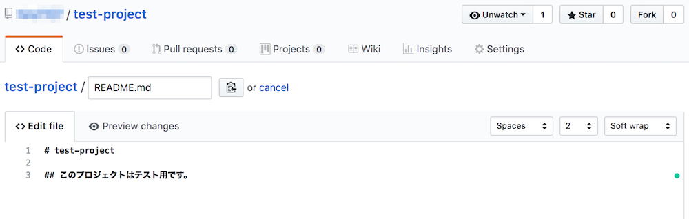

## `git pull`でリモート上の変更をローカルに反映する。

さて、次にGitHub上でREADME.mdを編集してみましょう。



変更したらページ下部の"commit change"ボタンをクリックして変更を保存します。

この段階で、GitHub上のリポジトリはローカルのリポジトリに加えて1回分の変更が行われた状態となっています。

この変更をローカルリポジトリに反映しましょう。そのためには`git pull`というコマンドを利用します。

```bash
$ git pull
remote: Counting objects: 3, done.
remote: Compressing objects: 100% (2/2), done.
remote: Total 3 (delta 0), reused 0 (delta 0), pack-reused 0
Unpacking objects: 100% (3/3), done.
From https://github.com/ユーザー名/test-project
   3a6e5bd..df18a30  master     -> origin/master
Updating 3a6e5bd..df18a30
Fast-forward
 README.md | 2 ++
 1 file changed, 2 insertions(+)
```

すると上記のように、情報が表示されてGitHub上のリポジトリの変更がローカルリポジトリに反映されました。

今回は、GitHub上で直接編集しましたが、例えばチーム開発ならチームメンバーが加えた変更を`git pull`でローカルリポジトリに加えるというような使い方をするのが一般的です。

## 更に学ぼう

### 本で学ぶ

- [Pro Git(日本語)](https://git-scm.com/book/ja/v2)

第6章の部分にGitHubのことが書かれています。